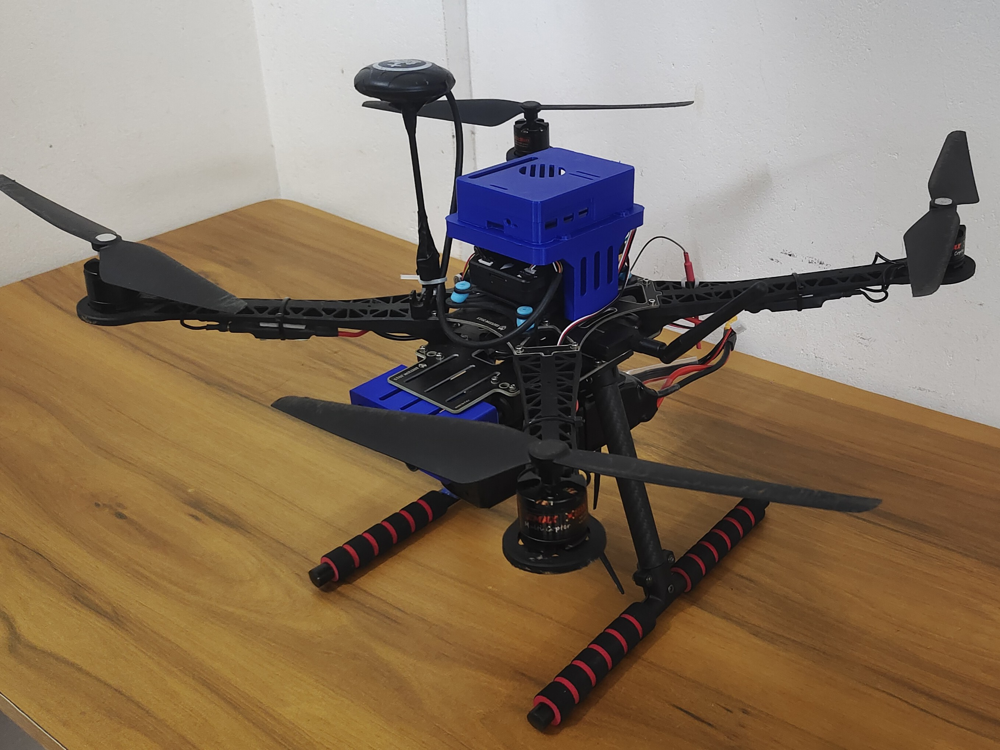
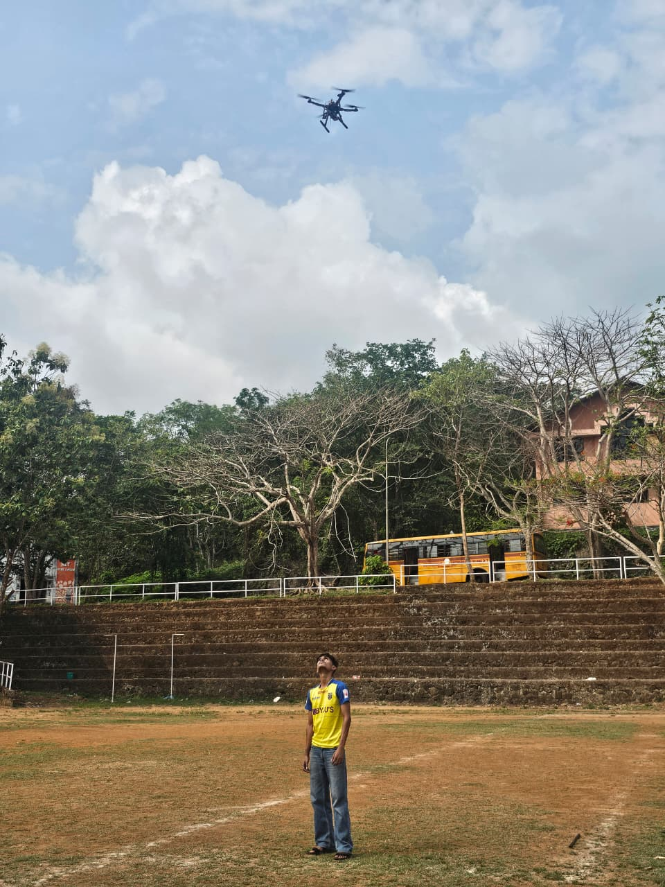
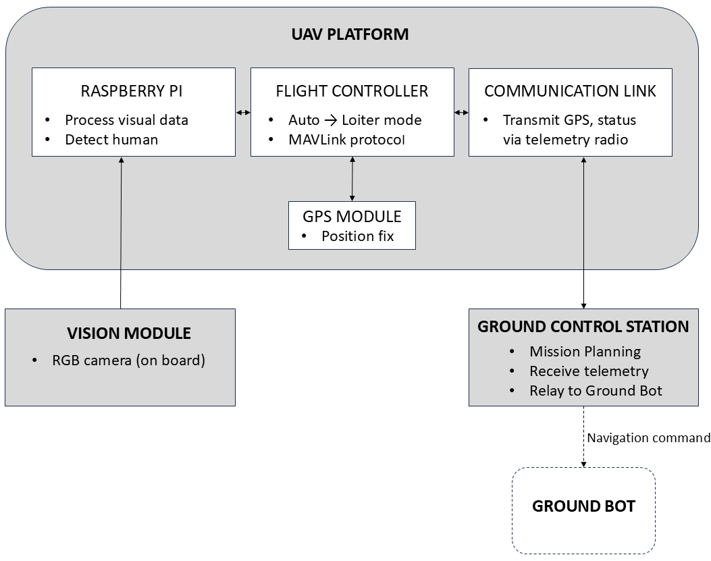
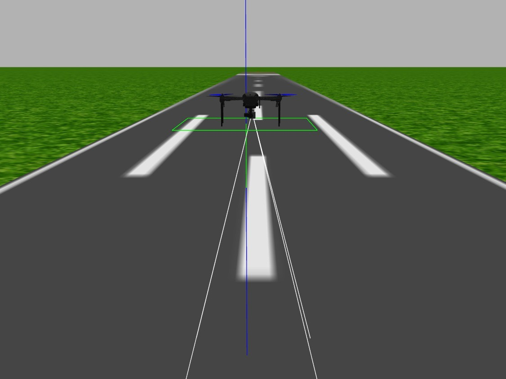

# Autonomous UAV for Disaster Relief
> Real-time human detection with automatic flight mode switching — Pixhawk + ROS + OpenCV

[](https://youtu.be/cPyBFfTFSc4)
[](https://github.com/suhaidpk)

---

<div style="display: flex; gap: 20px;">
  
  
</div>

<!-- Add a real photo here — even a phone photo of your drone is fine -->

---

## What This Does

An autonomous quadcopter designed for aerial search and rescue in disaster scenarios.
The drone follows a pre-planned mission autonomously, detects humans in real time using
computer vision, and automatically transitions to Loiter mode upon detection — capturing
GPS coordinates and relaying them to a ground control station for rescue coordination.

---

## System Architecture


---

## Hardware

| Component | Specification |
|---|---|
| Frame | S500 quadcopter |
| Flight controller | Pixhawk 2.4.8 |
| Companion computer | Raspberry Pi 5 |
| Camera | Pi Camera Module 3 |
| Telemetry | 3DR 915 MHz radio |
| All-up weight | 1.8 kg |
| Thrust-to-weight ratio | 2:1 |

---

## Software Stack

| Layer | Technology |
|---|---|
| Human detection | Python + OpenCV |
| Flight control | ArduPilot + MAVLink |
| Drone communication | DroneKit |
| Simulation | Gazebo + ArduPilot SITL |
| Ground control | Mission Planner + custom GCS |

---

## How It Works

1. Drone arms and takes off in **Auto mode** following a pre-planned waypoint mission
2. Raspberry Pi 5 continuously processes Pi Camera feed using **OpenCV**
3. On human detection, DroneKit sends a **MAVLink command** to Pixhawk
4. Flight mode switches **Auto → Loiter** — drone holds position above detected person
5. GPS coordinates are captured and **relayed to GCS** over 915 MHz telemetry
6. Ground operator receives location for rescue team coordination

---

## Simulation Before Flight

All mission logic was validated in **Gazebo + ArduPilot SITL** before real-world flights.

```bash
# Launch ArduPilot SITL
sim_vehicle.py -v ArduCopter --console --map

# Run detection and mission script
python3 mission.py
```


<!-- Add your Gazebo screenshot here -->

---

## Results

- Passed integration tests across all 4 flight modes
- Successful real-world outdoor flight tests
- Human detection triggers Loiter mode reliably in 1.5 seconds
- GPS coordinates delivered to GCS within 3 seconds of detection
- Detection accuracy is upto 30%

---

## Challenges & How I Solved Them

**1. GPS Glitch**
→ Signal quality was improved by mounting the GPS module on a raised mast, away from the PDB and ESCs

**2. Barometer Error**
→ The Pixhawk 2.4.8 barometer error was fixed by setting {BARO\_OPTIONS = 1} in ArduPilot to match the hardware variant.

**3. Pixhawk 2.4.8 Compatibility**
→ Several parameters were manually adjusted and a stable firmware version was selected to suit the older hardware.

**4. SITL to real flight differences**
→ Simulation helped verify flight logic, but the real drone behaved differently due to wind, sensor noise, vibrations, and communication delays. This required re-tuning parameters, showing that simulation cannot fully replace real-world testing.

<!-- This section is gold for interviews — be honest about what went wrong -->

---

## About

Built as a final year B.Tech project — Robotics & AI Engineering  
Rajiv Gandhi Institute of Technology, Kottayam, Kerala  
APJ Abdul Kalam Technological University | 2022–2026

**Muhammed Suhaid P K**  
[pksuhaid@gmail.com](mailto:pksuhaid@gmail.com) |
[LinkedIn](https://linkedin.com/in/suhaid-pk4) |
[GitHub](https://github.com/suhaidpk)
